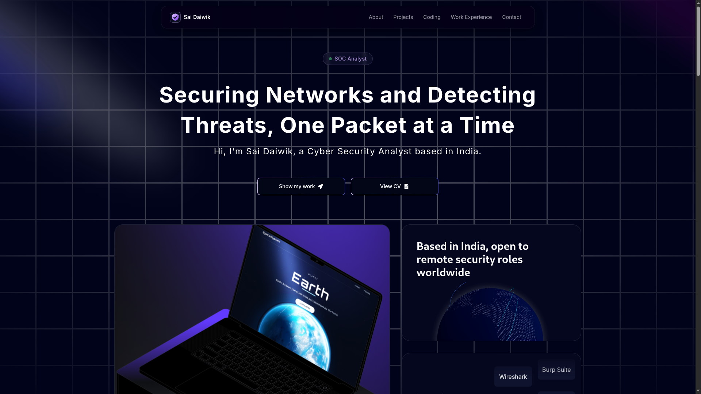
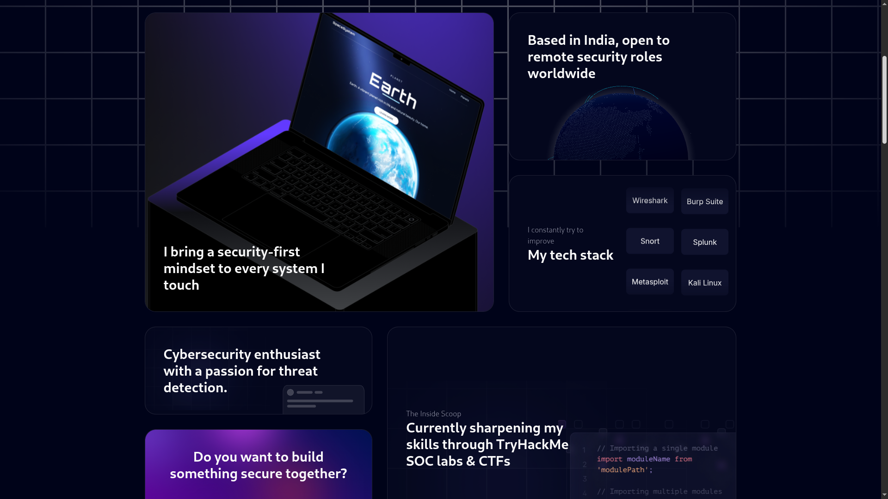
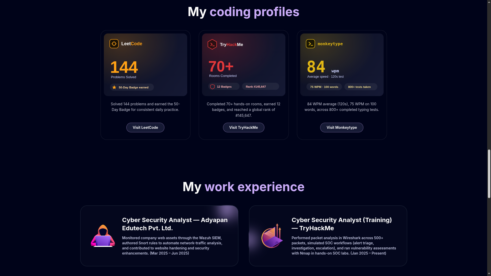

<div align="center">

# 🛡️ V Sai Daiwik — Portfolio

### *Securing Networks and Detecting Threats, One Packet at a Time*

A modern, animated personal portfolio for a **Cyber Security Analyst** — built with Next.js, TypeScript, Tailwind CSS, Framer Motion and Three.js.

<br/>


<br/>



</div>

---

## 📖 Introduction

This is my personal portfolio website — a single-page, fully responsive, dark-themed experience that showcases my journey in **cybersecurity**: my projects, coding profiles, work experience, and the way I approach securing systems. It blends interactive 3D elements, smooth animations, and a clean, professional design.

> 🌐 **Live Demo:** _Coming soon_ — deploy to [Vercel](https://vercel.com) and drop the link here.

---

## ✨ Features

- 🧭 **Sticky Resizable Navbar** — animated top bar with logo, smart shrink-on-scroll, and a mobile hamburger menu.
- 🟢 **Animated Hero** — a pulsing green-dot badge cycling through cyber roles (SOC Analyst, Threat Hunter, Penetration Tester…) with a spotlight background and a one-click **View CV** button.
- 🧱 **Interactive Bento Grid** — an "about me" section featuring a 3D GitHub-style globe and an **auto-scrolling tech-stack marquee**.
- 🔐 **Project Showcase** — 3D pin cards for my security projects, each with custom-designed SVG cover art.
- 🏆 **Coding Profiles** — branded stat cards for LeetCode, TryHackMe, and Monkeytype.
- 🧑‍💻 **Work Experience** — moving-border cards highlighting my professional background.
- 🎯 **My Approach** — an animated canvas section walking through my SOC detection-and-response workflow.
- 📬 **Contact Footer** — animated text-flip with a **Drop a Mail** call-to-action and social links.
- 📱 **Fully Responsive** — looks great on every device, from phones to ultrawide monitors.

---

## 🛠️ Tech Stack

| Category | Technologies |
| --- | --- |
| **Framework** | Next.js 14 (App Router), React 18 |
| **Language** | TypeScript |
| **Styling** | Tailwind CSS, `clsx`, `tailwind-merge` |
| **Animation** | Framer Motion, `tailwindcss-animate` |
| **3D / Visuals** | Three.js, `@react-three/fiber`, `@react-three/drei`, `three-globe` |
| **Icons & Extras** | React Icons, React Lottie |

---

## 📸 Preview

<div align="center">

**🏠 Hero — landing with animated role badge & spotlight**


**🧱 About — bento grid, 3D globe & auto-scrolling tech stack**



**🏆 Coding Profiles & Work Experience**



</div>

---

## 🧩 Sections

| # | Section | Highlights |
| --- | --- | --- |
| 1️⃣ | **Hero** | Rotating role badge · spotlight · View CV |
| 2️⃣ | **About** | Bento grid · 3D globe · auto-scrolling tech stack |
| 3️⃣ | **Projects** | NIDS · Password Manager · Text-Encryption-Suite |
| 4️⃣ | **Coding Profiles** | LeetCode · TryHackMe · Monkeytype |
| 5️⃣ | **Work Experience** | Adyapan Edutech · TryHackMe SOC training |
| 6️⃣ | **My Approach** | Monitor & Assess → Detect & Investigate → Respond & Harden |
| 7️⃣ | **Contact** | Drop a Mail · GitHub · LinkedIn |

---

## 🔐 Featured Projects

| Project | Description |
| --- | --- |
| 🛰️ **[Network Intrusion Detection System](https://github.com/SaiDaiwikV/Network-Intrusion-Detection-System)** | Real-time NIDS in Python + Snort 3 + Wireshark — detects port scans, brute-force, ping sweeps, and web intrusions. |
| 🔑 **[Simple Password Manager](https://github.com/SaiDaiwikV/Simple-password-manager)** | Tkinter GUI vault with SHA-512 auth, PBKDF2 key derivation, and AES/Fernet encryption. |
| 🔒 **[Text-Encryption-Suite](https://github.com/SaiDaiwikV/Text-Encryption-Suite)** | CLI toolkit with 10+ classical & modern ciphers (Caesar, Vigenère, AES, DES, Blowfish, RSA…). |

---

## 🚀 Getting Started

### ✅ Prerequisites

- [Node.js](https://nodejs.org/) **18+**
- npm (bundled with Node.js)

### 📥 Clone the repository

```bash
git clone https://github.com/SaiDaiwikV/portfolio.git
cd portfolio
```

### 📦 Install dependencies

```bash
npm install
```

### 🧪 Run the development server

```bash
npm run dev
```

Open [http://localhost:3000](http://localhost:3000) in your browser. 🎉

### 🏗️ Build for production

```bash
npm run build
npm run start
```

---

## 📁 Project Structure

```
portfolio/
├── app/                 # Next.js App Router (layout, page, icon, styles)
├── components/          # Section components (Hero, Grid, Footer, …)
│   └── ui/              # Reusable UI (Navbar, BentoGrid, Pin, Globe, …)
├── data/                # Site content (projects, profiles, experience)
├── public/              # Images, SVGs, icons
├── utils/               # Helpers (cn)
└── tailwind.config.ts   # Theme & animations
```

---

## 🌍 Deployment

The easiest way to deploy is with **[Vercel](https://vercel.com/)** (creators of Next.js):

1. Push this repo to GitHub.
2. Import it into Vercel.
3. Deploy — zero configuration needed. ✅

---

## 📫 Connect With Me

<div align="center">

[](mailto:vsaidaiwik@gmail.com)
[](https://github.com/SaiDaiwikV)
[](https://www.linkedin.com/in/vontimitta-saidaiwik)

</div>

---

## 📝 License

This project is licensed under the **MIT License** — feel free to explore and learn from it.

---

## 🙏 Acknowledgements

- Design system powered by **[Aceternity UI](https://ui.aceternity.com/)** components.
- Built with the amazing open-source ecosystem around **Next.js**, **Three.js**, **Framer Motion**, and **Tailwind CSS**. 💜

<div align="center">

**⭐ If you like this portfolio, consider giving it a star!**

</div>
